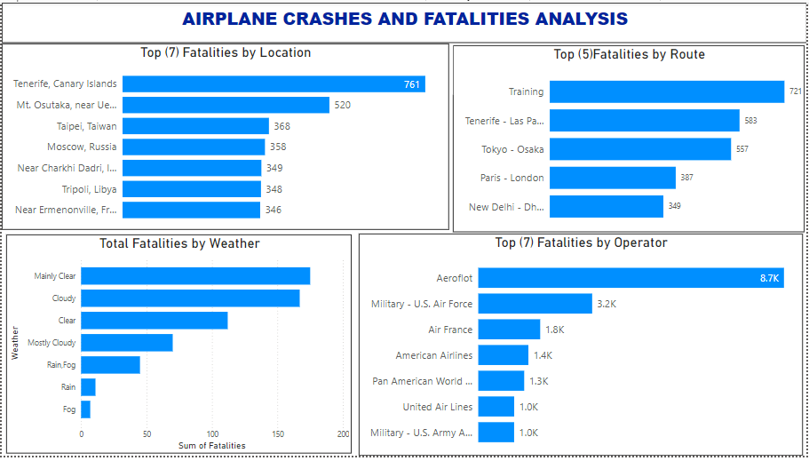

# Airplane-Crashes-and-Fatalities-Analysiss
## Airplane-Crashes-and-Fatalities-Analysis

## Background/Introduction
The aviation industry plays a crucial role in global transportation, connecting people and goods across the world. However, airplane crashes remain a significant concern due to their devastating impact on human lives and the industry's reputation. Understanding the factors contributing to airplane crashes is essential for improving safety measures and reducing the risk of accidents.

Weather conditions have been identified as one of the critical factors influencing airplane operations and potentially contributing to crashes. Adverse weather conditions, such as storms, fog, and strong winds, can pose challenges to pilots, affecting visibility, maneuverability, and overall flight safety.
      

## Objectives
The primary objective of this project is to analyze and explore the relationship between airplane crashes and weather conditions. By combining two datasets - "Airplane_Crashes_and_Fatalities_Since_1908_to_2023" and weather data - we aim to identify patterns, trends, and potential correlations that can provide insights into the factors influencing airplane crashes.

## Problem Statement
Airplane crashes continue to be a significant concern in the aviation industry, leading to tragic loss of life, substantial financial costs, and lasting impacts on the affected communities and the industry at large. Despite advancements in technology and safety measures, airplane crashes still occur, raising questions about the underlying factors contributing to these incidents.

Weather conditions have long been recognized as a potential risk factor in aviation, with adverse weather conditions posing challenges to pilots and affecting flight safety. Understanding the relationship between weather conditions and airplane crashes is essential for enhancing safety protocols, improving pilot training, and implementing preventive measures to mitigate the risk of accidents.

- What is the total number of fatalities by location?
- How do fatalities vary by weather conditions?
- What is the total number of fatalities on each route?
- How do fatalities differ across operators?
- How many fatalities occurred at each location?
- How many fatalities were associated with each weather condition?
- How many fatalities occurred on each route?
- How many fatalities were reported for each operator?

## Data Sourcing
Explain where the data is gotten from and describe the tables 

## Data Cleaning
The two data set was loaded into power query through microsoft excel. 
- There are some empty cell which was replaced with unspecified.
- The data type of each column was change were necessary

## Data Modeling
Data modeling is a critical step in preparing the dataset for analysis, ensuring that the data is structured in a way that facilitates meaningful insights and efficient querying. In this project, we will create a relational data model that combines the airplane crashes dataset with the weather data and incorporates a Date table to support time-based analysis.
There are three(3) tables namely;
- Airplane Crashes Data: Contains information about airplane crashes, fatalities, and other relevant details.
- Weather Data: Includes weather conditions, temperature, wind speed, visibility, and atmospheric pressure.
- Date Table: A separate table containing a comprehensive list of dates to support time-based analysis.

## Data Analysis and Visualization.

From the Dashboard, It is observed that 
INSIGHT
- What is the total number of fatalities by location?
- The visualization provides valuable insights into the locations that have recorded the highest number of fatalities from airplane crashes. Understanding these locations can help identify high-risk areas and inform decision-making processes to enhance aviation safety measures, improve emergency response strategies, and reduce the likelihood and impact of future airplane accidents in these regions.
  - Tenerife, Canary Islands, stands out with the highest number of fatalities, indicating a significant airplane crash event.
  - Mt. Osutaka near Ueno Village, Japan, and Taipei, Taiwan, have also experienced notable fatalities from airplane accidents.
  - Moscow, Russia, and near Charkhi Dadri, India, report a considerable number of fatalities, emphasizing regional risks.
  - Tripoli, Libya, and France have recorded significant fatalities, highlighting the importance of aviation safety in these areas.
 
- How do fatalities vary by weather conditions?
-The visualization shows the total number of fatalities associated with airplane crashes under different weather conditions.
  - The visualization provides valuable insights into the relationship between weather conditions and airplane crashes, with various weather categories contributing to fatalities. Understanding these patterns can help identify weather-related risks and inform decision-making processes to enhance aviation safety measures, improve pilot training, and develop advanced weather monitoring systems to mitigate the impact of adverse weather conditions on flight safety.

- What is the total number of fatalities on each route?
  - Training routes have resulted in fatalities, indicating risks associated with pilot training exercises.
  - The Tenerife-Las Palmas route has recorded fatalities, highlighting challenges in this specific flight path.
  - The Tokyo-Osaka route has experienced fatalities, emphasizing potential risks during this domestic flight.
  - The Paris-London route has reported fatalities, suggesting challenges in one of the busiest air corridors.
     
- How do fatalities differ across operators?
  - Aeroflot: Aeroflot has recorded a significant number of fatalities, indicating challenges or incidents associated with this airline.
Military
  - US Air Force: The US Air Force has experienced notable fatalities, reflecting the risks and challenges in military aviation operations.
  - Air France: Air France has reported a considerable number of fatalities, emphasizing the importance of safety measures and protocols for commercial airlines.
American Airlines:
  - American Airlines has recorded fatalities, highlighting the need for continuous efforts to improve aviation safety and reduce risks in commercial aviation.

- How many fatalities occurred at each location?
  - Moscow, Russia (16): Significant fatalities, highlighting risks in this region.
  - Taipei, Taiwan (6): Notable fatalities, indicating challenges in this area.
  -  Tripoli, Libya (4): Considerable fatalities, emphasizing safety concerns.
  - Tenerife, Canary Islands (3): Reported fatalities, suggesting risks in this location.
        
- How many fatalities were associated with each weather condition?
  - Mainly Clear (175): Associated with fatalities, suggesting potential risks even in clear conditions.
  - Cloudy (167): Notable fatalities, indicating challenges in cloudy weather.  
  - Mostly Cloudy (112): Reported fatalities, emphasizing risks under variable cloud cover.
    
- How many fatalities occurred on each route?
  - Training (88): Fatalities reported during training exercises, highlighting risks in pilot training.
  - Paris - London (4): Fatalities recorded on this busy air corridor, indicating challenges in this route.
  -  Tokyo - Osaka (2): Fatalities reported on this domestic route, emphasizing potential risks.
  -  
- How many fatalities were reported for each operator?
  **This shows the worst performing Operator Ever**
  - Aeroflot (247): Significant fatalities, indicating challenges or incidents associated with this airline.
Military - US Air Force (131): Notable fatalities, reflecting risks in military aviation operations.
Air France (72): Considerable fatalities, emphasizing the importance of safety measures for commercial airlines.
United Airlines (44): Fatalities reported, highlighting the need for continuous safety improvements.
Pan America World Airways (41): Reported fatalities, suggesting challenges in this airline's operations.

 
 ## Recommendation
 - Enhance safety protocols and monitoring systems in high-risk locations such as Moscow, Taipei, and Tripoli to mitigate potential risks and improve aviation safety.
- Implement advanced weather monitoring and forecasting systems to provide real-time updates on variable weather conditions, helping pilots make informed decisions and reduce risks associated with cloudy and mostly cloudy conditions.
- Conduct comprehensive safety audits and risk assessments for high-traffic routes like Paris-London and Tokyo-Osaka to identify potential hazards and implement targeted safety measures to improve flight safety.
- Collaborate with airlines such as Aeroflot, Air France, United Airlines, and Pan America World Airways to review and enhance their safety protocols, training programs, and maintenance practices to reduce the likelihood of accidents and fatalities.

